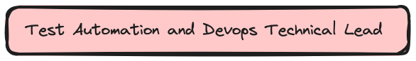
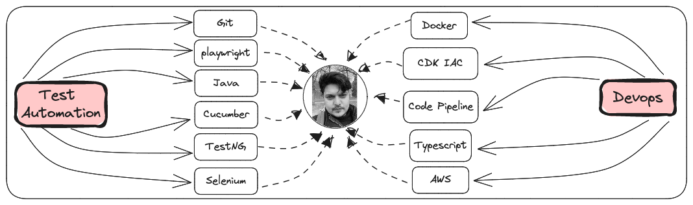

<h1>  Moikka </h1>

     I'm Sunny, Test Automation and Devops Technical Lead, currently living in <b>Pune , India </b>.

I am a seasoned IT professional with extensive experience in Test Automation and DevOps transformation, and team leadership. I have managed teams and ensured the smooth functioning of multiple Selenium Frameworks and AWS Devops pipelines while providing automation support to several daily tasks as well as test Automation.</b>

### Skills
#### `Test Automation`
| Selenium | TestNG | Java | Cucumber | Playwright |
| -- | -- | -- | -- | -- |
| [Data Driven Framework](https://github.com/sunnyRavindra/DataDrivenFramework) | Parallel Execution | Core Java | Gherkins |
| Page Object Model (POM) | Annotations | 
| Extent Reports | Data Provider |  
|  | Parametrization |

#### `Devops`
| AWS | Docker | Jenkins | 
| -- | -- | -- |
| CDK IAC (Infrastructure as code) | Test Dockerization |
| Code Commit | 
| Code Build |  

***
| [**`LinkedIn`**](https://www.linkedin.com/in/sunnybharne)| [**`Github`**](https://github.com/sunnyRavindra/sunnyRavindra) | [**`Website`**](https://www.botcat.org) | [**`Email`**](sunny.bharne.devops@gmail.com) |

