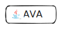
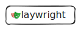

<h1></h1>

     I'm Sunny, Test Automation and Devops Technical Lead, currently living in <b>Pune , India </b>.

I am a seasoned IT professional with extensive experience in Test Automation and DevOps transformation, and team leadership. I have managed teams and ensured the smooth functioning of multiple Selenium Frameworks and AWS Devops pipelines while providing automation support to several daily tasks as well as test Automation.</b>

#### `Test Automation`

    
   
- [Data Driven Framework](https://github.com/sunnyRavindra/DataDrivenFramework) 
- Page Object Model (POM)
- Extent Reports
- Annotations 
- Data Provider
- Parametrization
- Core Java
- Gherkins

#### `Devops`

    
- CDK IAC (Infrastructure as code)
- Code Commit
- Code Build
- Test Dockerization

|  |  |  |  |  |
| -- | -- | -- | -- | -- |
| [Data Driven Framework](https://github.com/sunnyRavindra/DataDrivenFramework) | Parallel Execution | Core Java | Gherkins |
| Page Object Model (POM) | Annotations | 
| Extent Reports | Data Provider |  
|  | Parametrization |

#### `Devops`
|  |  |  | 
| -- | -- | -- |
| CDK IAC (Infrastructure as code) | Test Dockerization |
| Code Commit | 
| Code Build |  

<h1></h1>

#### `Contact Me`
      

